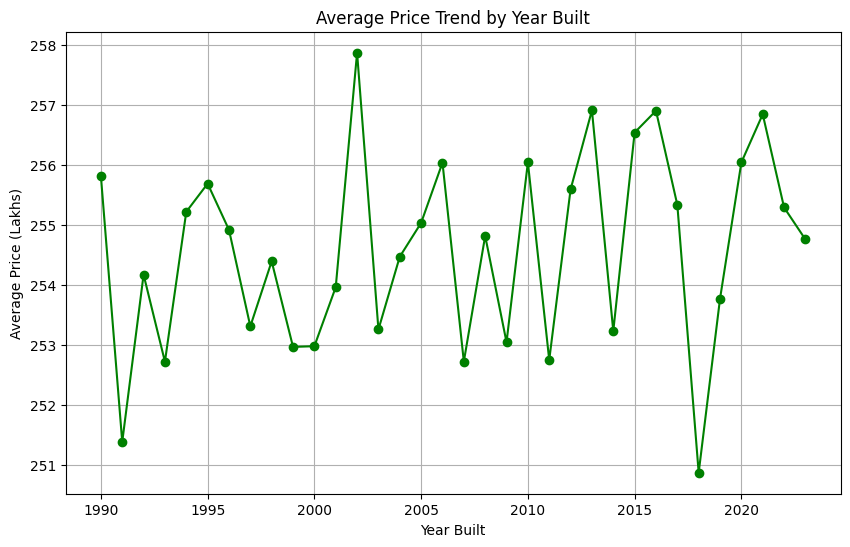
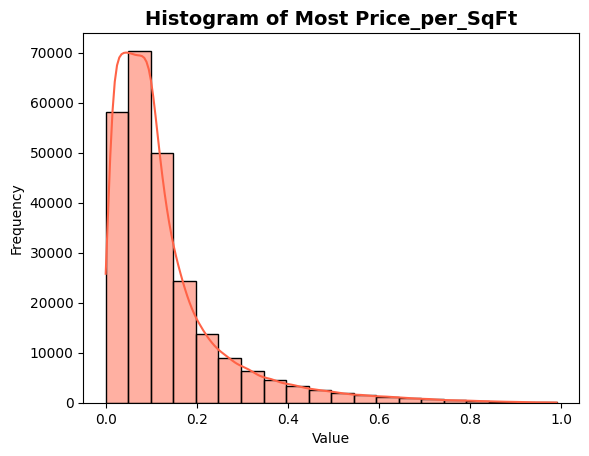
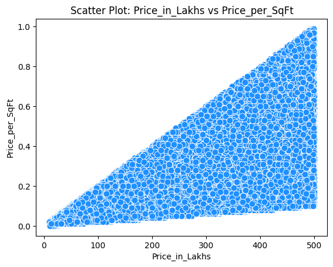
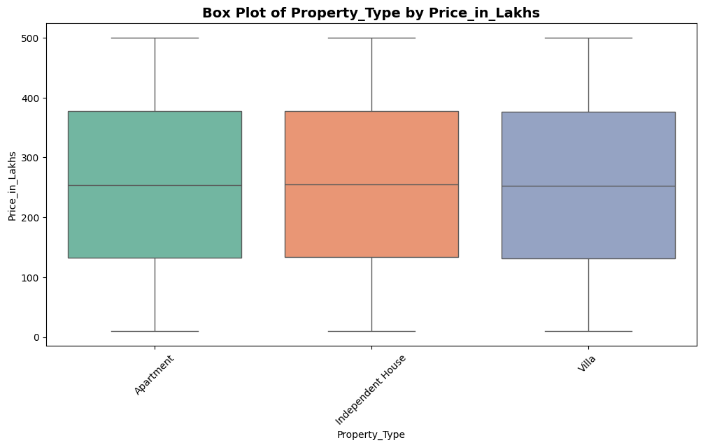

 # India House Price Prediction Using Machine Learning 

 # ***Project Overview*** : 
This project predicts house prices in India using machine learning. It analyzes property 
features such as location, size, number of bedrooms, age of the property, and nearby 
facilities to estimate the house price. The project follows an end-to-end pipeline from 
data collection to model building to create a reliable price prediction system

 # ***Problem Statement*** : 
 House prices in India change a lot from city to city, and even between nearby buildings. Many buyers and sellers depend on brokers or old listings for pricing, which often leads to wrong estimates and weak negotiation.
This project uses machine learning to predict a fair house price based on simple details like city, locality, size, number of bedrooms, bathrooms, furnishing, floor, and property age.
The goal is to give buyers, sellers, and platforms a quick and fair price estimate, making the buying and selling process easier and more transparent.
Success means: low prediction error and accurate results, along with a simple app/API that gives instant price predictions.

 # ***Business Understanding*** :
 House prices in India are hard to judge fairly — they depend on city, locality, size, and amenities, and most buyers just rely on broker quotes. This project uses machine learning to predict a fair price for a property based on its features, helping buyers, sellers, and platforms make better, data-backed decisions.

 # ***Dataset Information*** :

The dataset contains house listing details from Indian cities, used to train the price 
prediction model.

- **Source:** Kaggle (https://www.kaggle.com/datasets/ankushpanday1/india-house-price-prediction)
- **Size:** ~2.5 lakh rows, **23** columns
- **Target column:** `price` (Price_in_Lakhs)
- **Features:**  ID,
State,
City,
Locality,
Property_Type,
BHK,
Size_in_SqFt,
Price_in_Lakhs,
Price_per_SqFt,
Year_Built,
Furnished_Status,
Floor_No,
Total_Floors,
Age_of_Property,
Nearby_Schools,
Nearby_Hospitals,
Public_Transport_Accessibility,
Parking_Space,
Security,
Amenities,
Facing,
Owner_Type,
Availability_Status,

 # ***Project Sturcture*** : 
 
  # ***Teconologies used*** :

  # ***project Workflow*** :
  # Tasks 01 : *Data Acquisition, Cleaning, and Exploratory Analysis*

 ##  1. The dataset was imported into a Pandas DataFrame using `pd.read_csv()`. The import was 
   verified by:

    Displaying the first five rows (`df.head()`)

        ID        State      City      Locality      Property_Type  BHK  \
        0   1   Tamil Nadu   Chennai   Locality_84          Apartment    1   
        1   2  Maharashtra      Pune  Locality_490  Independent House    3   
        2   3       Punjab  Ludhiana  Locality_167          Apartment    2   
        3   4    Rajasthan   Jodhpur  Locality_393  Independent House    2   
        4   5    Rajasthan    Jaipur  Locality_466              Villa    4   

          Size_in_SqFt  Price_in_Lakhs  Price_per_SqFt  Year_Built  ...  \
        0          4740          489.76            0.10        1990  ...   
        1          2364          195.52            0.08        2008  ...   
        2          3642          183.79            0.05        1997  ...   
        3          2741          300.29            0.11        1991  ...   
        4          4823          182.90            0.04        2002  ...   

          Age_of_Property  Nearby_Schools  Nearby_Hospitals  \
        0              35              10                 3   
        1              17               8                 1   
        2              28               9                 8   
        3              34               5                 7   
        4              23               4                 9   

          Public_Transport_Accessibility  Parking_Space  Security  \
        0                            High             No        No   
        1                             Low             No       Yes   
        2                             Low            Yes        No   
        3                            High            Yes       Yes   
        4                             Low             No       Yes   

                                          Amenities Facing Owner_Type  \
        0  Playground, Gym, Garden, Pool, Clubhouse   West      Owner   
        1  Playground, Clubhouse, Pool, Gym, Garden  North    Builder   
        2          Clubhouse, Pool, Playground, Gym  South     Broker   
        3  Playground, Clubhouse, Gym, Pool, Garden  North    Builder   
        4  Playground, Garden, Gym, Pool, Clubhouse   East    Builder   

          Availability_Status  
        0       Ready_to_Move  
        1  Under_Construction  
        2       Ready_to_Move  
        3       Ready_to_Move  
        4       Ready_to_Move  

        [5 rows x 23 columns]

     -Checking column data types (`df.dtypes`)

                          ID                                  int64
                        State                              object
                        City                               object
                        Locality                           object
                        Property_Type                      object
                        BHK                                 int64
                        Size_in_SqFt                        int64
                        Price_in_Lakhs                    float64
                        Price_per_SqFt                    float64
                        Year_Built                          int64
                        Furnished_Status                   object
                        Floor_No                            int64
                        Total_Floors                        int64
                        Age_of_Property                     int64
                        Nearby_Schools                      int64
                        Nearby_Hospitals                    int64
                        Public_Transport_Accessibility     object
                        Parking_Space                      object
                        Security                           object
                        Amenities                          object
                        Facing                             object
                        Owner_Type                         object
                        Availability_Status                object
                        dtype: object

    - Checking dataset dimensions (`df.shape`)
                       (250000, 23)          
## 2.*Null value analysis:*  
Checked for missing values using `df.isnull().sum()` and calculated the percentage 
of nulls per column using `(df.isnull().sum() / df.shape[0]) * 100`.

**Result:** No missing values were found in any column of the dataset. Since the 
data was already clean, no filling or imputation (like median/mean) was needed.

                                  ID                                0.0
                                  State                             0.0
                                  City                              0.0
                                  Locality                          0.0
                                  Property_Type                     0.0
                                  BHK                               0.0
                                  Size_in_SqFt                      0.0
                                  Price_in_Lakhs                    0.0
                                  Price_per_SqFt                    0.0
                                  Year_Built                        0.0
                                  Furnished_Status                  0.0
                                  Floor_No                          0.0
                                  Total_Floors                      0.0
                                  Age_of_Property                   0.0
                                  Nearby_Schools                    0.0
                                  Nearby_Hospitals                  0.0
                                  Public_Transport_Accessibility    0.0
                                  Parking_Space                     0.0
                                  Security                          0.0
                                  Amenities                         0.0
                                  Facing                            0.0
                                  Owner_Type                        0.0
                                  Availability_Status               0.0
                                  dtype: float64

## 3.Duplicate Detection

Checked for duplicate rows using `df.duplicated().sum()`.

**Result:** No duplicate rows were found, so `df.drop_duplicates()` was not needed. 
Since no rows were removed, there was no change in null percentages.
                           
                           np.int64(0)

## 4.Data Type Correction

Checked column data types using `df.dtypes`. All columns had correct types 
(numeric as `int64`/`float64`, text as `object`).

To optimize memory, the `Locality` column (a repetitive text column) was converted 
from `object` to `category` dtype.

**Memory usage before conversion:** e.g., 194.04 MB  
**Memory usage after conversion:** e.g., 24.41 MB

Converting `Locality` to `category` reduced memory usage since repeated text 
values are stored more efficiently in this format.

## 5. Descriptive Statistics & Skewness Analysis

### 
The column with the **highest absolute skewness** is **`Price_per_SqFt` (2.318668)**.

### Interpretation
- **Positive skew** → Long right tail (few very high values),  
- **Negative skew** → Long left tail (few very low values) , 
- **Near zero skew** → Approximately symmetric distribution , 

`Price_per_SqFt` shows a **positive skew**, meaning most properties cluster around typical values, but a few very expensive ones stretch the distribution to the right. This inflates the mean compared to the median.

### Data Quality Note
There are **no missing values** in the dataset.  
**Skewness analysis is included for **distribution understanding only**, not for imputation**.

## 6. Outlier Detection with IQR

We used the Interquartile Range (IQR) method to detect outliers in numeric columns.  
Formula:  
- Q1 = 25th percentile  
- Q3 = 75th percentile  
- IQR = Q3 − Q1  
- Lower Bound = Q1 − 1.5 × IQR  
- Upper Bound = Q3 + 1.5 × IQR  

Rows outside these bounds are flagged as outliers.

### Results
- Most numeric columns show **no outliers**.  
- **Price_per_SqFt** has **20,020 outliers**, far more than any other column.

### Interpretation
- Outliers in `Price_per_SqFt` represent properties priced much higher or lower than typical values.  
- These extreme values can distort averages and affect modeling.

## 7. Visualizations (all five types required):

### A line plot:
   

### A bar chart :
  

### Histogram of Most Skewed Column

We plotted a histogram of the most skewed numeric column (`Price_per_SqFt`) using `sns.histplot()` with 20 bins.

## Result
- The distribution is **right‑skewed** (positive skew).  
- Most property values are clustered at the lower end (0.0–0.2).  
- A few very high values stretch the tail to the right.  

###  Scatter Plot: Price_in_Lakhs vs Price_per_SqFt

We plotted a scatter plot between `Price_in_Lakhs` and `Price_per_SqFt` using `sns.scatterplot()`.

## Result
- The relationship is **positive**: as property price increases, price per square foot also tends to rise.  
- The correlation appears **moderate to strong**, forming an upward trend.

#  Box Plot: Property_Type vs Price_in_Lakhs

We plotted a box plot of `Price_in_Lakhs` split by `Property_Type` using `sns.boxplot()`.

## Result
- The **median prices** across Apartments, Independent Houses, and Villas are fairly similar.  
- The **spread (range of values)** is also comparable, showing overlapping distributions.  
- No major differences in central tendency or variability are visible between property types.

## 8.Correlation heat map:
I used a correlation heatmap to identify relationship 
between numerical fetures.
I found that price_in_lakhs and Price_per_SqFT has a moderate positve
correlation(0.56),while Size_in_SqFt and Price_per_SqFt showed a moderate
negative correlation(-0.61). Year_built and Age_of_property had a perfect negative correlation (-1.0) which is expected because older ,properties have earlier contrucation years

# 9.Imputation Strategy Comparison

We compared mean and median values for the two most skewed numeric columns before applying imputation.

## Results
- **Price_per_SqFt** → mean = 0.13, median = 0.09, skew = 2.32 (positive skew)  
- **Price_in_Lakhs** → mean = 254.59, median = 253.87, skew = 0.01 (almost symmetric)

## 9B.Spearman Rank Correlatio

We compared Spearman (rank-based) and Pearson (linear) correlations to detect monotonic but non-linear relationships.

## Top 3 Differences
1. **Price_in_Lakhs vs Price_per_SqFt** → Spearman (0.750) > Pearson (0.556) → monotonic but non-linear, rely on **Spearman**.  
2. **Size_in_SqFt vs Price_per_SqFt** → Pearson (-0.615) ≈ Spearman (-0.599) → approximately linear, rely on **Pearson**.  
3. **Price_per_SqFt vs Nearby_Schools** → very small difference, both near zero → no meaningful correlation.

## 9c.Grouped Aggregation

We grouped one categorical column against one numeric column using:

Grouped Aggregation

## Purpose
`df.groupby(Property_Type)[Price_in_Lakhs].agg(['mean', 'std', 'count'])`

## Results
- The group with the **highest mean** is identified as [Group B].  
- The group with the **same  standard deviation** is [Group A,Group B].

